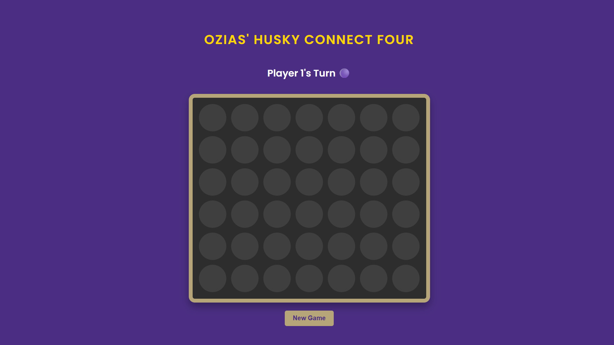

# Ozias' UW-Themed Connect Four 🐺

A full-stack Connect Four web application featuring a RESTful API backend built with Java & Spring Boot and a dynamic frontend using vanilla HTML/CSS/JS. The project is themed for the University of Washington, complete with custom styling and a personalized win screen.

---

### **✨ [Live Demo]( https://ozias-tumimana.github.io/connect-four-springboot/)** ✨

*Note: The backend is hosted on a free service and may take up to 50 seconds to "wake up" on the first visit.*

---

## **Key Features**

* **Full Gameplay Logic:** A robust backend that handles turns, validates moves, and detects horizontal, vertical, and diagonal win conditions.
* **Interactive UI:** A clean, responsive interface with sound effects for moves, user-friendly error messages, and a custom UW theme.
* **Personalized Win Screen:** A dynamic pop-up modal featuring Dubs the mascot that congratulates the winner.
* **RESTful API:** A well-structured backend built with Spring Boot that manages the entire game state.
* **Containerized Deployment:** The backend is containerized using Docker, ensuring a consistent and reliable deployment environment.

---

## **Tech Stack**

* **Backend:** Java 17, Spring Boot, Maven
* **Frontend:** HTML5, CSS3, Vanilla JavaScript
* **Deployment:** Docker, Render (Backend), GitHub Pages (Frontend)
* **Testing:** JUnit

---

## **Screenshots**

### The Game Board


### The Dubs Win Screen


---

## **How to Run Locally**

1.  **Clone the repository:**
    ```bash
    git clone [https://github.com/Ozias-Tumimana/connect-four-springboot.git](https://github.com/Ozias-Tumimana/connect-four-springboot.git)
    ```
2.  **Navigate to the backend directory:**
    ```bash
    cd connect-four-springboot/connectfour-api
    ```
3.  **Run the Spring Boot application:**
    ```bash
    ./mvnw spring-boot:run
    ```
4.  **Open the frontend:**
    * Navigate to the `src/main/resources/static` folder.
    * Open the `index.html` file in your web browser.
